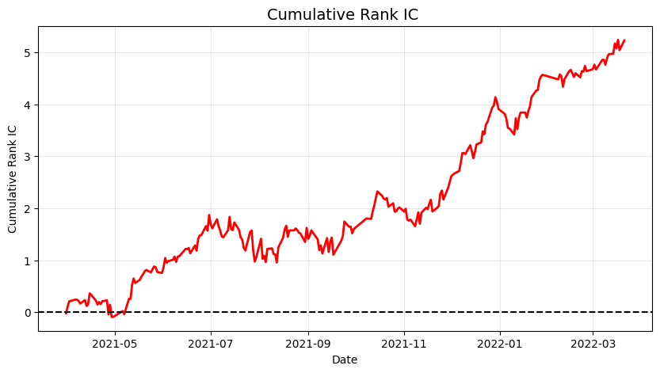

# Quant-Alpha-Transformer

基于深度学习的高频量价 Alpha 因子挖掘与回测管线。本项目基于中证 500 成分股与 Qlib Alpha158 数据集，探讨了不同时序模型在低信噪比金融数据下的截面预测能力，并重点验证了旋转位置编码（RoPE）对 Transformer 架构在量化场景下的性能改进。

## 实验结果

在纯样本外测试集（2021.04 - 2022.03）上的单模型预测表现：

| 模型架构 | 核心机制 | Mean Rank IC | IC IR | 胜率 (Accuracy) | 备注 |
| :--- | :--- | :--- | :--- | :--- | :--- |
| **GRU (Baseline)** | 循环平移不变性 | 0.0201 | 0.2266 | 59.75% | 基础特征提取，表现稳健 |
| **Vanilla Transformer** | 绝对位置编码 | 0.0091 | 0.0643 | 53.39% | 绝对位置编码破坏时序平移不变性，泛化失败 |
| **RoPE Transformer** | **相对位置编码** | **0.0221** | **0.1594** | **58.47%** | **最优表现。保留平移不变性的同时提升了长序列关注度** |

## 核心实现

* **内存管线优化**：在滑动窗口张量生成阶段，摒弃动态列表拼接，采用 `np.empty` 进行物理连续内存预分配，解决大批量高维面板数据加载时的 OOM 问题。
* **数据清洗与防范未来函数**：采用单向前向填充与逐日截面 Z-score 中性化，严格规避 Lookahead Bias。
* **模型抗噪**：针对金融收益率分布的长尾特征，采用 `SmoothL1Loss` (Huber Loss) 替代 MSE 作为损失函数，降低极端值对梯度的扰动。

## 样本外表现

<div align="center">
  
</div>

> **图示说明**：上图为模型在纯样本外区间（2021年4月 - 2022年3月）的 Cumulative Rank IC 曲线。整体收益曲线呈现稳健向上的趋势，累计 IC 最终突破 5.0。在 2021 年三季度（7月-11月），受极端周期股行情与市场风格剧烈切换影响，模型经历了真实的短期回撤与横盘震荡。但自 2021 年 11 月起，模型展现出极强的自适应与泛化能力，曲线迅速收复失地并走出陡峭的上升趋势，验证了SmoothL1Loss在应对极端逆风期时的鲁棒性。

## 后续规划

* 计划在单票时序网络的基础上引入 Cross-Sectional Transformer 模块。
* 探索通过截面注意力机制（Cross-Sectional Attention）自发学习行业动量与风格轮动，实现内生截面中性化。

## 快速运行

### 1. 安装依赖环境：
```bash
git clone [https://github.com/xueyuchou/Quant-Alpha-Transformer.git](https://github.com/xueyuchou/Quant-Alpha-Transformer.git)
cd Quant-Alpha-Transformer
pip install -r requirements.txt
```
### 2. 获取数据
本项目使用 Qlib 标准 Alpha158 特征集，请确保已初始化 Qlib 数据：
```Bash
python -m qlib.run.get_data qlib_data --target_dir ~/.qlib/qlib_data/cn_data --region cn
```

### 3. 运行主控脚本
```bash
python train.py
```